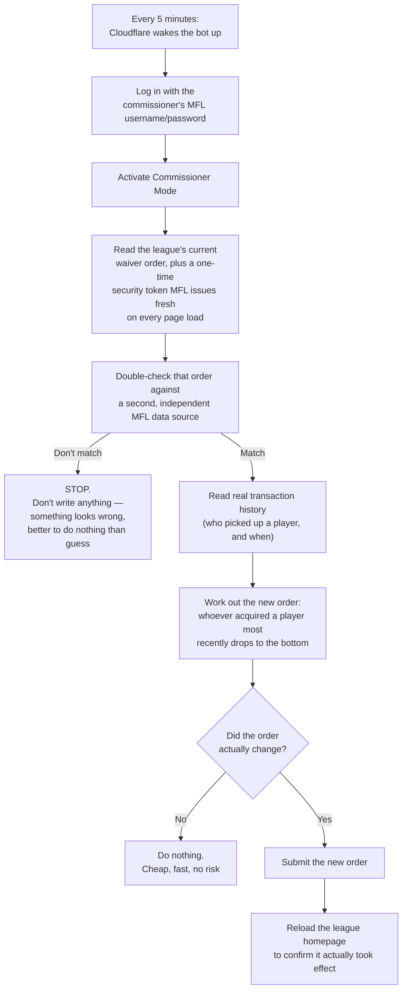
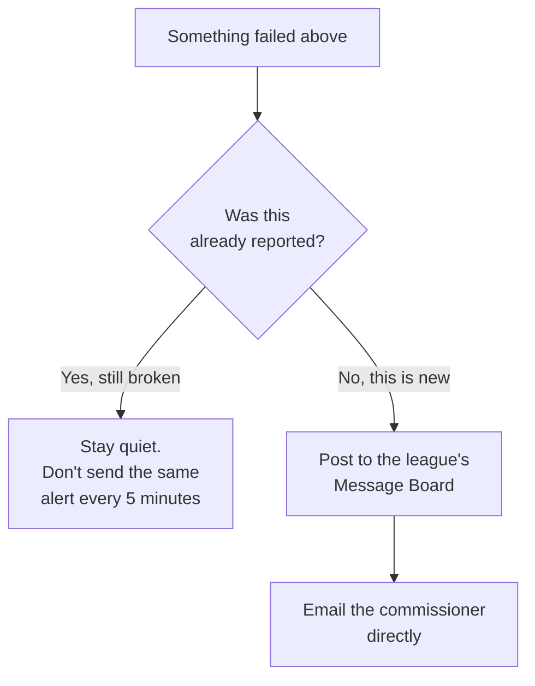
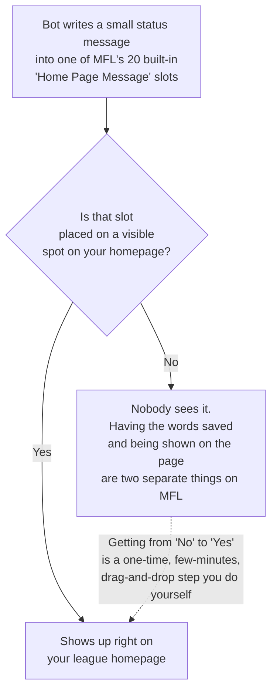

# How It Works (and Why It Works This Way)

A plain-language walkthrough of what the bot actually does, step by
step — including *why* certain steps exist at all, especially the ones
that look like they should be simpler than they are. If
`docs/DEVELOPMENT_NOTES.md` is the reference for "the exact field
names," this is "the story," for anyone (commissioner, new developer,
or a future AI session) who wants the shape of the thing before the
details.

## The main loop: checking and updating the waiver order

**Why "Activate Commissioner Mode" is its own separate step (C)**: on
MFL, logging in and being *treated as* the commissioner for a specific
league are two different things. An account can successfully log in
and still get served a generic, stripped-down page — commissioner
powers only turn on after one more specific step. This single fact
caused an entire earlier version of this project to fail and get
mis-diagnosed as something else entirely (see `LESSONS_LEARNED.md`) —
it's the single most important "why" in this whole project.

**Why step E (the double-check) exists**: the page that shows the
current order and the page used to verify it are two genuinely
different sources inside MFL. If they ever disagree, that's a sign
something changed on MFL's end that the bot doesn't understand yet —
so it refuses to guess and stops instead of possibly writing something
wrong.

**Why step K uses "MFL's real commissioner form" and not a clean API
call**: MFL has a proper, official, documented way to *read* things
like transaction history — but setting the waiver order itself has no
such official method. The only way to do it, for a human or a robot,
is the same web form a commissioner would fill in by hand. So that's
what the bot uses — reading the real form, filling it in the same way,
submitting it the same way. Not a shortcut; the only actual door.

## When something goes wrong: alerting

**Why both a Message Board post and an email**: different people check
different things. A message board post is visible to the whole league
context; an email lands somewhere a commissioner will actually see
even if they're not on the site. Both use MFL's own real, official
tools for exactly this — nothing gets sent through some other outside
service.

**Why it goes quiet after the first alert**: if something's broken, it
tends to stay broken for a while (until a person fixes it) — the bot
checks every 5 minutes, so without this, one problem would mean dozens
of repeat alerts. It only speaks up again once things go back to
working and then break a *second*, separate time.

## The optional homepage status box — and why placing it is a manual step

**Why the bot can't do this last part too**: arranging what shows up
where on an MFL homepage — which modules appear, in what order, in
which column — is only available through MFL's own point-and-click
admin screen. There's no equivalent "arrange the page" tool in MFL's
official developer toolkit at all, for anyone — not just this project.
Writing the *words* that go in the status box is something the bot can
do on its own (and does, automatically, once an hour); putting that
box in a specific spot on the page is something only a real person
clicking around in MFL's own settings can do. So that one step —
placing it directly under the Waiver Wire Order box — is yours to do
once, and then it's done for good.

## The general pattern behind all of this

A short summary, since it repeats throughout the project: **whenever
MFL provides an official, documented way to do something, the bot uses
that.** Reading transaction history, reading franchise/league info,
posting to the Message Board, sending email — all real, official,
documented tools. **Only when no official tool exists at all** does
the bot fall back to using the same real web forms and pages a human
commissioner would click through by hand — never a shortcut or a
trick, just the same front door everyone else uses, automated. And
when *neither* exists — like arranging the homepage layout — that part
stays a manual, one-time, human step, because there's genuinely no
other way to do it, for anyone.
